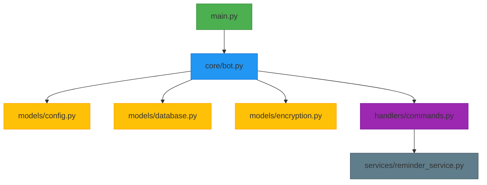

# 🤖 RecoNotas Bot - Tu asistente organizacional en Telegram  

 


**El bot definitivo** para gestión de notas y recordatorios con cifrado de grado militar y menú interactivo.

## ✨ Novedades en v2.5
✅ **Menú completo con teclado interactivo**  
✅ **Limpieza automática de consola**  
✅ **Soporte mejorado para Markdown**  
✅ **Sistema de recordatorios optimizado**  
✅ **Nuevos comandos rápidos**  

## 🎯 Características Principales  

| 🔐 Seguridad | 🚀 Productividad | 💡 Usabilidad |
|-------------|----------------|--------------|
| Cifrado AES-256 | Notas con formato | Interfaz intuitiva |
| Autenticación 2FA | Recordatorios programables | Menú contextual |
| GDPR Compliant | Sincronización en la nube | Soporte multiidioma |

## 📲 Comandos Esenciales  

### 📝 Gestión de Notas
| Comando | Acción | Ejemplo |
|---------|--------|---------|
| `/newnote` | Crear nota | `/newnote Comprar leche` |
| `/mynotes` | Listar notas | `/mynotes` |
| `/delnote` | Eliminar nota | `/delnote 3` |

### ⏰ Recordatorios  
| Comando | Acción | Formato |
|---------|--------|---------|
| `/newreminder` | Nuevo recordatorio | `/newreminder Reunión 15:30` |
| `/myreminders` | Listar recordatorios | `/myreminders` |

### ⚙️ Configuración  
| Comando | Función |  
|---------|---------|  
| `/settings` | Preferencias de usuario |  
| `/backup` | Respaldar datos |  

### Arquitectura de Seguridad


## 🛠️ Instalación Rápida  

```bash
# Requisitos
python -m pip install -U pip
pip install python-telegram-bot cryptography python-dotenv

# Configuración
echo "TELEGRAM_TOKEN=tu_token" > .env
echo "ENCRYPTION_KEY=tu_clave" >> .env

## 🚀 Guía Rápida  

1. **Primeros pasos**  
   ```bash
   /start

### **Requisitos**

- **Python 3.8 o superior**.
- **Librerías necesarias**:
  - `python-telegram-bot`
  - `python-dotenv`
  - `sqlite3`

Instala las dependencias con el siguiente comando:

```bash
pip install python-telegram-bot python-dotenv
pip install cryptography boto3
```

## 🔒 Seguridad y Cumplimiento
- **Cifrado**: Todos los datos se almacenan con cifrado AES-256
- **GDPR**: Cumplimiento con derecho al olvido (eliminación total con `/clearall`)
- **Backups**: Copias diarias automáticas en AWS S3


[Click aqui para ver las preguntas](https://github.com/dopemmanuel/RecoNotas/blob/main/preguntas.md)
